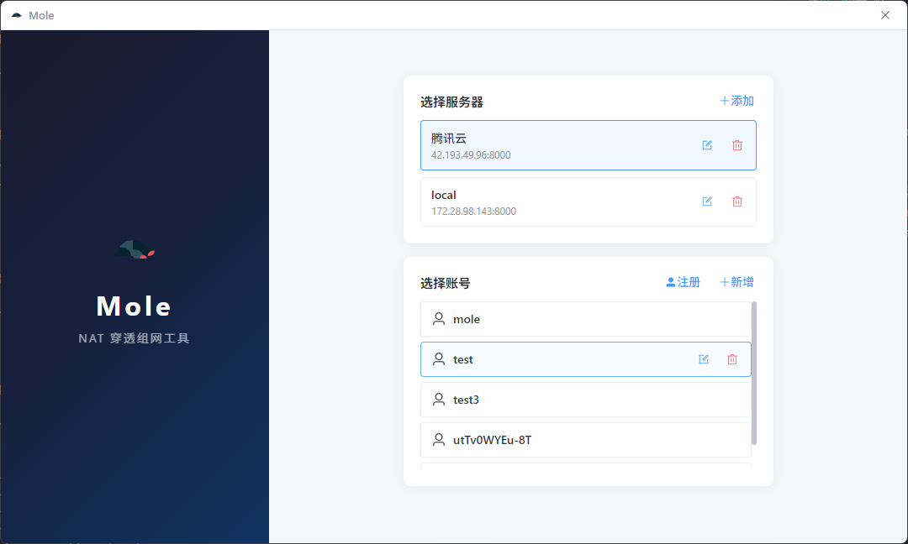
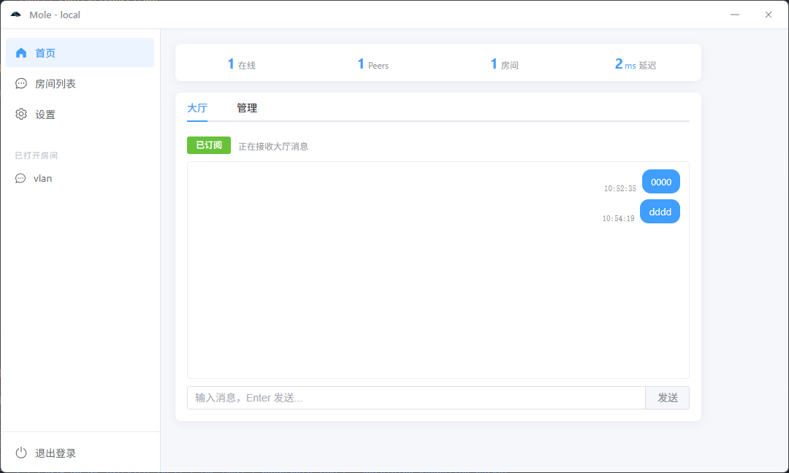
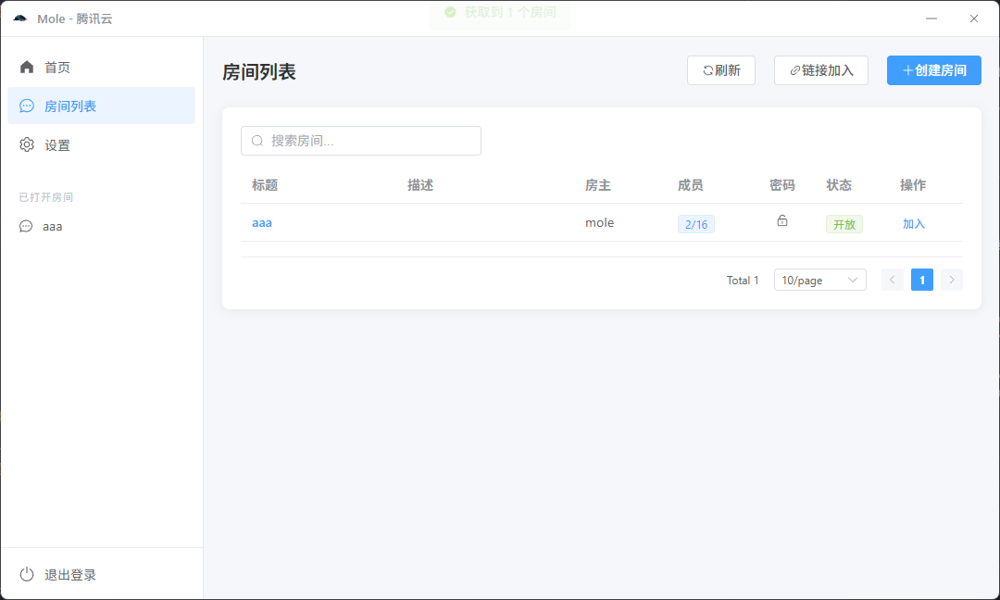

# Mole — NAT 穿透组网工具

基于 WireGuard 实现的虚拟局域网组网工具，支持 NAT 穿透、P2P 直连和中继转发。客户端内置三层广播转发机制，适用于依赖广播发现的局域网联机游戏。

> 使用前请关闭 Windows 防火墙。

## 功能特性

- **WireGuard 虚拟组网** — 基于 Curve25519 加密的点对点隧道
- **NAT 穿透与直连** — 自动探测公网地址，尝试 P2P 直连，失败回退中继
- **房间管理** — 创建/加入/关闭房间，密码保护，链接分享
- **成员管理** — 实时成员列表，直连状态可视化，踢人、黑名单
- **即时通讯** — 房间内文字聊天，系统消息通知
- **多服务器支持** — 管理多个后端服务器，切换账号登录

## 技术栈

| 层 | 技术 |
|----|------|
| 桌面框架 | Electron 34 |
| 前端 | Vue 3 + TypeScript + Element Plus |
| 状态管理 | Pinia |
| 构建 | Vite + electron-builder |
| 网络层 | WireGuard DLL + WinDivert |
| 通信 | WebSocket + HTTP |

## 页面截图

### 登录页

选择服务器、管理账号，支持注册和缓存密码一键登录。



### 服务器首页

查看在线连接数、WG Peers、活跃房间和延迟信息。管理员可生成账号、控制注册开关。



### 房间列表

浏览、搜索房间，支持分页刷新。可通过房间链接加入，创建新房间。



### 聊天室

实时聊天、成员面板，头像边框颜色指示直连状态（绿=已直连 / 绿闪=直连中 / 红=失败）。点击成员头像可踢人或加入黑名单。


## 快速开始

```bash
# 安装依赖
npm install

# 开发模式
npm run dev

# 构建安装包
npm run build
```

## 目录结构

```
mole/
├── lib/                    # C++ 原生模块（WireGuard DLL）
│   ├── wireguard_handle.cpp
│   ├── wireguard_tool.cpp
│   └── src/
│       ├── wireguard.h
│       └── windivert.h
├── src/
│   ├── main/               # Electron 主进程
│   │   ├── electron-main.ts
│   │   ├── preload.ts
│   │   └── ipcApi.ts
│   ├── renderer/           # Vue 渲染进程
│   │   ├── components/     # Vue 组件
│   │   ├── route/          # 路由配置
│   │   ├── utils/          # 工具函数、API
│   │   └── styles/         # 全局样式
│   └── shared/             # 共享模块
└── package.json
```

## 相关项目

后端服务：[ginWeb](https://github.com/dust-2021/ginWeb.git)