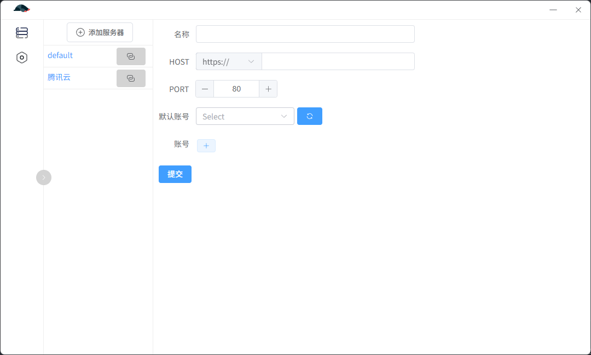
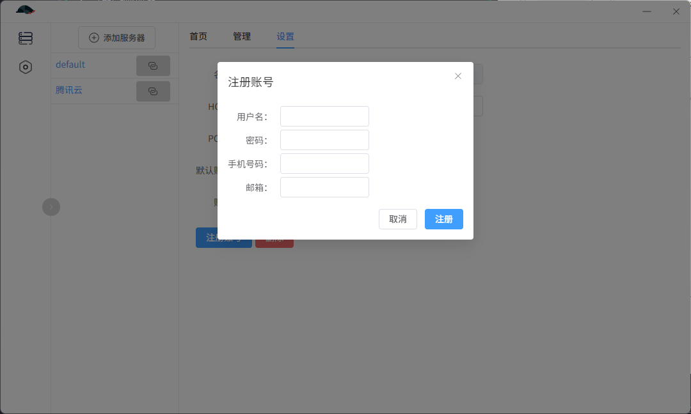
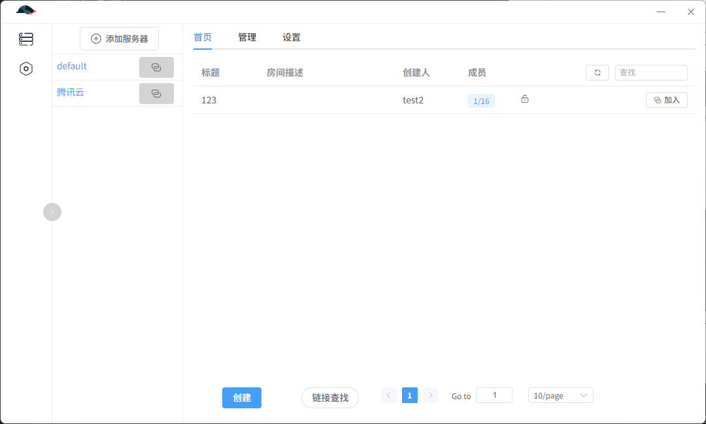
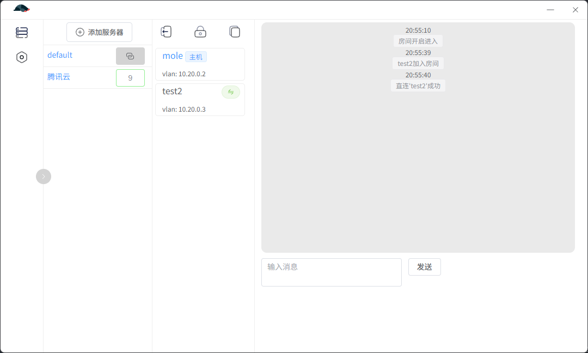

## 局域网联机工具

基于`wireguard`实现的三层组网工具，在客户端实现了三层广播转发机制，适用于三层广播实现的局域网联机游戏。

使用时需要关闭防火墙。

1. 添加后端服务器：
   
   填写服务器地址信息，并添加账号
2. 注册账号：
   
   添加服务器后，可以进行账号注册（需要管理员开放注册）。
3. 组网：
   
   完成信息填写后即可开始创建、加入房间。
4. 房间：
   
   房间创建后处于关闭状态，房主可以获取免密链接，成员进入房间后使用服务器中继，获取到真实地址后尝试wg直连，失败后回退中继模式。